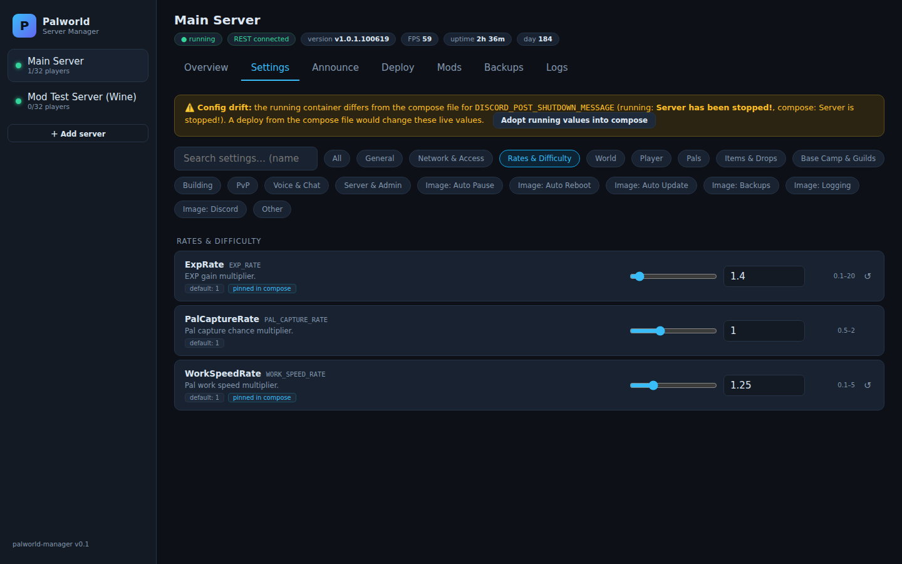

# Palworld Server Manager (bundled)

Web UI for managing palworld-server-docker instances: live dashboard, all
settings with validation and drift detection, in-game announcements,
review-and-deploy with countdown + live validation, Steam Workshop mod
browser (pak mods on this Linux image), backups, world export/import/
migration, and multi-server support.

**Deploy and test at your own risk** — this tool edits your compose file and
restarts your server on deploys.

Quick start: edit `config/servers.json` and `docker-compose.yml` in this
directory, then `docker compose up -d --build` and open `http://<host>:8220`.

Standalone repo, full documentation and screenshots:
**https://github.com/1tsmejp/palworld-server-manager**

